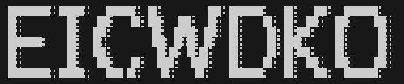

# CSCI-101-final-project

**This is the repository for the final semester project in Professor Kassandra Jenkins' CSCI 101 course in the Spring 2026 semester (CRN 82343).**

### Details
- Student Name: Holden Coffman
- Project Topic: Printing Multidimensional Arrays
- Due Date: Sunday, March 8th, 2026 - 11:59 PM

### Explanation of the Task and My Code

For this program, we were given a Word document with a table containing x and y coordinates, and a Unicode character for each coordinate pair. Our task was to convert that Word document into a text file, then write a program that reads the data from the file and creates a two-dimensional array, initialized with spaces. From there, the program reads the Unicode characters into their corresponding x and y row/column locations in the 2D array. Finally, you print the array to reveal a hidden message, which in this case was the code `EICWDKO`.

## Final Result - Screenshot
 

 

---

*If you have any questions about this repository, please contact Holden Coffman at hcoffman6@ivytech.edu*